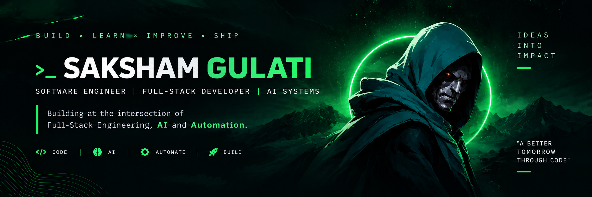

<p align="center">
  
</p>

<br/>

<div align="center">

<a href="https://github.com/SaKshDEV">
  
</a>


</div>

<br/>

---
## 🚀 Project Journey

<table>
<tr>

<td width="50%" valign="top">

### ⚡ TaskFlow

**Full-Stack Task Management Platform**

A full-stack application I built to strengthen my understanding of authentication, REST APIs, protected routes, CRUD operations, and frontend-backend integration.

**Built With**

`React` `Node.js` `Express.js` `MongoDB` `JWT`

**Key Engineering**

- 🔐 JWT Authentication
- 🛡️ Protected APIs
- ✅ Task CRUD
- 🔍 Search & Filtering
- 👤 User-specific data
- 🔗 Frontend + Backend integration

**Status:** ✅ Built

</td>

<td width="50%" valign="top">

### 💳 Payment Recovery System

**Payment Infrastructure & Recovery Workflows**

Building a transaction recovery platform focused on payment failures, recovery cases, backend workflows, and Razorpay integration.

**Building With**

`React` `Node.js` `Express.js` `MongoDB` `Razorpay`

**Focus**

- 💸 Transaction processing
- 🔁 Recovery workflows
- 📦 REST APIs
- ⚠️ Failed-payment handling
- 📊 Recovery tracking
- 🔌 Razorpay integration

**Status:** 🚧 Building

</td>

</tr>

<tr>

<td width="50%" valign="top">

### 🛡️ AgentProof AI

**AI Agent Evaluation Platform**

Building a platform for evaluating and comparing AI agents across versions to understand their quality, reliability, and performance.

**Building With**

`MERN` `Tailwind CSS` `AI APIs` `Evaluation Systems`

**Focus**

- 🧠 AI evaluations
- 🔄 Version comparison
- 📊 Evaluation dashboards
- ⚡ Reliability metrics
- 🤖 AI integrations
- 🏗️ Production-ready architecture

**Status:** 🚧 Building

</td>

<td width="50%" valign="top">

### 🤖 JARVIS

**Personal Intelligent AI Assistant**

My next flagship project — a JARVIS-inspired AI system designed to move beyond normal chatbot interactions and actually perform actions.

**Planned Stack**

`Python` `LLMs` `AI Agents` `APIs` `Automation`

**Planned**

- 🎙️ Voice interaction
- 🧠 Persistent memory
- 🔧 Tool calling
- ⚙️ Automation
- 🌐 Real-time information
- 🤖 Agentic workflows

**Status:** 🧠 Planned

</td>

</tr>
</table>

---


## ⚙️ Developer Mode

```javascript
const saksham = {
    role: "Software Engineer",

    building: [
        "AgentProof AI",
        "Payment Recovery System"
    ],

    exploring: [
        "AI Agents",
        "LLMs",
        "Automation",
        "System Design"
    ],

    nextMission: "Build my own JARVIS 🤖",

    philosophy: "Build → Break → Learn → Improve → Ship"
};
```

## 🧰 Tech Arsenal

<div align="center">

<table>
<tr>

<td width="33%" align="center" valign="top">

### ⚡ Languages


</td>

<td width="33%" align="center" valign="top">

### 🎨 Frontend


</td>

<td width="33%" align="center" valign="top">

### ⚙️ Backend


</td>

</tr>

<tr>

<td width="33%" align="center" valign="top">

### 🗄️ Database


</td>

<td width="33%" align="center" valign="top">

### 🛠️ Tools


</td>

<td width="33%" align="center" valign="top">

### 🧠 Engineering

<br/>

`REST APIs`

`JWT Auth`

`Socket.IO`

`Razorpay`

`AI APIs`

</td>

</tr>
</table>

</div>

---


## 📊 GitHub Activity

<div align="center">


<br/><br/>


</div>

---

<div align="center">

### `FULL-STACK` × `AI` × `AUTOMATION`

**Building software today. Intelligent systems tomorrow.**

</div>

---
## 🤝 Connect With Me

<div align="center">

<a href="https://www.linkedin.com/in/saksham-gulati-a372952b3/">
  
</a>

<a href="mailto:sakshamgulati333@gmail.com">
  
</a>

<a href="https://github.com/SaKshDEV">
  
</a>

<br/><br/>

### ⚡ Open to Software Engineering & Full-Stack opportunities

**Building. Learning. Shipping.**

</div>
